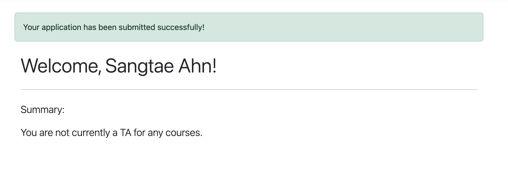
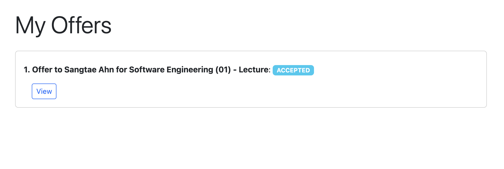
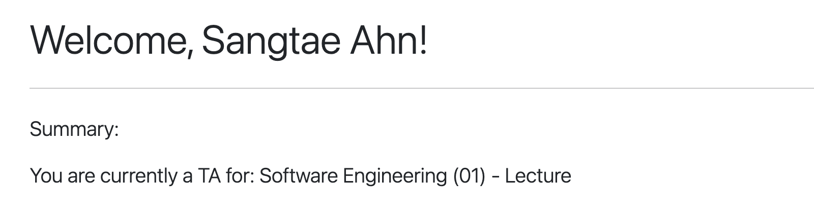

# Getting Started
BC CS Department TA System

## Prerequisites
- BC Google Account (@bc.edu)
- Access to the TA system (Within BC network or Eagle VPN)

## Login
1. Navigate to the [TA system homepage](https://cscigpu03.bc.edu:8080/)
2. Click on "Login" or "Sign in with Google"
3. Authenticate using your BC Google Account (@bc.edu)
4. You will be redirected to the home page after successful authentication

---

## If you are a Student

### 1. Explore Courses

- Browse the list of available courses that are actively seeking TAs
- Filter courses by professor (optional)
- Click on a course to view details including:
  - Course title, section, and class type
  - Instructor information
  - Course description
  - Number of TAs needed
  - Current TA assignments

### 2. Create an Application
- From the course detail page, click "Apply" to create an application
- Fill out the application form:
  - Add any additional information you'd like to share with the professor (optional, max 500 characters)
- Submit your application
- **Note:** You can apply to a maximum of 5 courses:
  - For Lecture courses: Each lecture counts as one application
  - For Discussion/Lab courses: Applications are grouped by course name (e.g., all CS1101 discussions count as one application)
- You cannot apply if:
  - You are already a TA for another course
  - You have already applied to this specific course
  - You have reached the maximum of 5 applications
  

### 3. View Your Applications

- Navigate to "My Applications" to see all your submitted applications
- Each application shows:
  - Course information
  - Application status (PENDING, ACCEPTED, REJECTED, CONFIRMED)
  - Additional information you provided
- You can:
  - View application details
  - Delete applications that are still PENDING

### 4. Receive and Respond to Offers
- When a professor accepts your application, you will receive an offer
- You will receive an email notification about the offer
- Navigate to "My Offers" to view all offers
- For each offer, you can:
  - **Accept the offer**: This confirms you as the TA for the course
    - The application status changes to CONFIRMED
    - You are assigned as a TA for the course
    - The professor receives a confirmation email
  - **Reject the offer**: This declines the TA position
    - The application status changes to REJECTED
    - The professor receives a notification
- **Note:** You cannot accept an offer if:
  - You are already a TA for another course
  - The course has reached its maximum number of TAs

### 5. After Accepting an Offer

- Your application status becomes CONFIRMED
- You are officially assigned as a TA for the course
- You can no longer apply to other courses or accept other offers

---

## If you are a Professor

### 1. View Your Courses
- After logging in, you will see courses you are teaching
- Each course shows:
  - Course details (title, section, class type)
  - Number of TAs needed vs. currently assigned
  - Course status (active/inactive)

### 2. Review Applications
- Click on a course to view its detail page
- See all applications submitted by students for that course
- Each application shows:
  - Student name and information
  - Additional information provided by the student
  - Application status
- Navigate to "Applications" to see all applications across your courses

### 3. Accept or Reject Applications
- **Accept an Application:**
  - Click "Accept" on an application
  - This creates an offer to the student
  - The application status changes to ACCEPTED
  - The student receives an email notification about the offer
  - You can only accept applications that are PENDING

- **Reject an Application:**
  - Click "Reject" on an application
  - The application status changes to REJECTED
  - The student receives an email notification
  - You can only reject applications that are PENDING

### 4. Manage Offers
- Navigate to "Offers" to view all offers you've sent
- See the status of each offer (PENDING, ACCEPTED, REJECTED)
- You can delete offers that are still PENDING (this resets the application to PENDING)
- When a student accepts your offer:
  - The offer status changes to ACCEPTED
  - The application status changes to CONFIRMED
  - The student is assigned as a TA for the course
  - You receive a confirmation email
- When a student rejects your offer:
  - The offer status changes to REJECTED
  - The application status changes to REJECTED
  - You receive a notification email

### 5. Course Management
- Courses automatically close when they reach the required number of TAs
- You can view the current TAs assigned to each course on the course detail page

---

## Application Status Flow

### For Students:
1. **PENDING** → Application submitted, waiting for professor review
2. **ACCEPTED** → Professor accepted your application and sent an offer
3. **CONFIRMED** → You accepted the offer, you are now a TA
4. **REJECTED** → Either professor rejected your application or you rejected an offer

### For Professors:
- Applications start as **PENDING**
- When you accept: Application becomes **ACCEPTED** and an offer is created
- When you reject: Application becomes **REJECTED**
- When student accepts offer: Application becomes **CONFIRMED**
- When student rejects offer: Application becomes **REJECTED**

---

## Email Notifications

The system sends email notifications for:
- **Students receive:**
  - When they receive an offer from a professor
  - When their application is rejected

- **Professors receive:**
  - When a student submits an application to their course
  - When a student accepts an offer
  - When a student rejects an offer

---

## Important Notes

- You must use a BC Google Account (@bc.edu) to access the system
- Students can apply to a maximum of 5 courses
- Students cannot apply if they are already a TA
- Courses automatically close when they reach the required number of TAs
- Once you accept an offer and become a TA, you cannot apply to other courses
